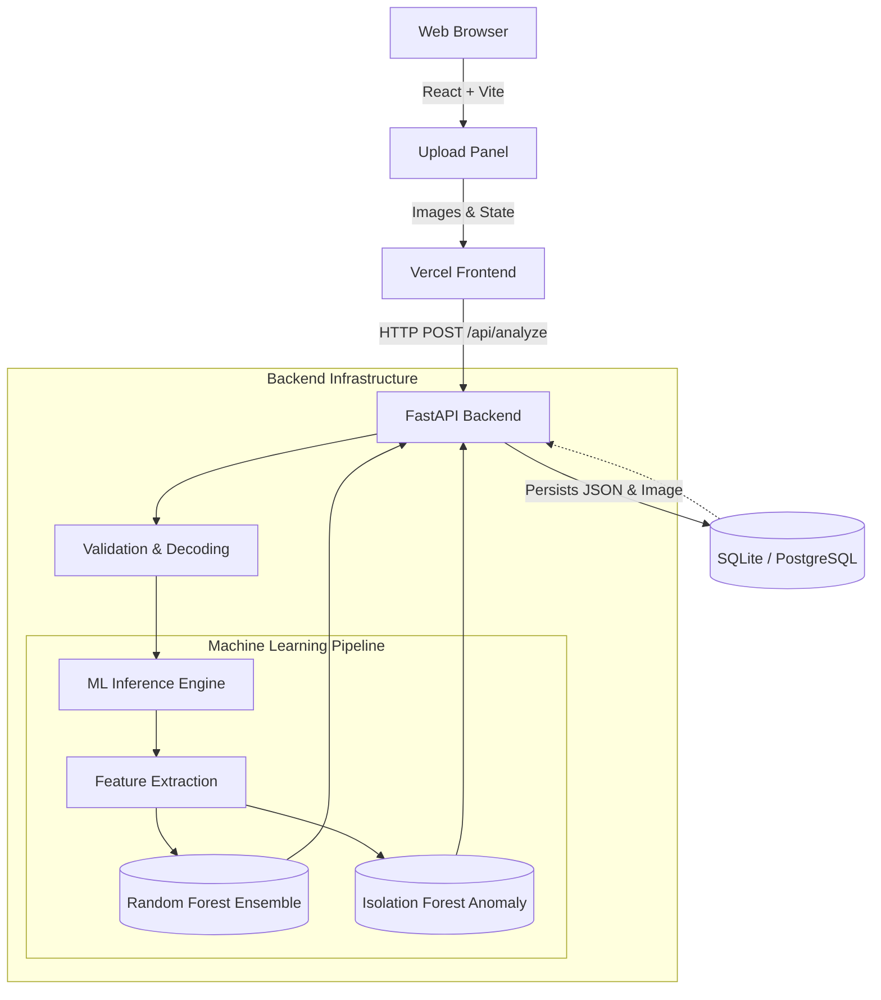

# Darkroom — AI-Powered Image Quality & Defect Detection

A full-stack application that inspects an uploaded image and reports whether
it's **ACCEPTABLE**, **DEGRADED**, or **DEFECTIVE**, detecting blur,
under/overexposure, noise, corruption, and generic "potential defects" —
without calling any external AI/vision API.



## 1. Quick start (Docker Compose — recommended)

```bash
git clone <this repo> && cd <this repo>
cp .env.example .env          # defaults work as-is for local use
docker compose up --build
```

- Frontend: http://localhost:3000
- Backend API: http://localhost:8000 (docs at http://localhost:8000/docs)
- Health check: http://localhost:8000/api/health

The backend image trains the model **during the Docker build** (a few
seconds, fixed random seed, no internet dataset download — see [Section
4](#4-aiml-approach--why-engineered-features--classical-ml)). The backend image verifies that trained artifacts are
available during build and retrains them automatically if they are missing.
If you cloned this repo with those artifacts included, the build reuses
them and skips retraining.

Data (SQLite DB + uploaded image copies) persists in the `backend_data`
Docker volume across restarts.

## 2. Running locally without Docker

**Backend**
```bash
cd backend
python3 -m venv venv && source venv/bin/activate
pip install -r requirements.txt
python -m app.ml.train        # trains the model, writes app/ml/artifacts/
uvicorn app.main:app --reload --port 8000
```

**Frontend** (separate terminal)
```bash
cd frontend
npm install
echo "VITE_API_URL=http://localhost:8000" > .env
npm run dev
```
Visit http://localhost:5173.

## 3. Project layout

```
backend/
  app/
    main.py              FastAPI app: /api/analyze, /api/results, /api/health
    database.py          SQLAlchemy engine/session (SQLite by default)
    models.py             AnalysisResult ORM model
    schemas.py            Pydantic response schemas
    utils/image_validation.py   Upload validation + safe decoding
    ml/
      features.py         Engineered image-quality feature extraction (20 features)
      cnn_features.py      Optional MobileNetV2 transfer-learning features (see Section 4)
      degrade.py           Synthetic degradation generator (training data)
      train.py             Training + evaluation pipeline
      infer.py             Loads trained artifacts, runs analysis
      artifacts/           Trained model files (generated by train.py)
  requirements.txt
  Dockerfile
frontend/
  src/
    App.jsx, components/  React UI (upload, report, history)
    api/client.js          REST client
  Dockerfile
  nginx.conf
docs/
  evaluation_report.md      Auto-generated metrics report (regenerated by train.py — always current)
  evaluation_report.json
  API.md                    Example requests/responses
sample_images/               Demo images covering each quality condition
docker-compose.yml
.env.example
```

## 4. AI/ML approach — why engineered features + classical ML

**Approach chosen: engineered image-quality features + a RandomForest per
issue type, plus an IsolationForest for open-set anomaly detection.**

**Why not (only) a CNN?** Engineered IQA (image-quality-assessment)
features — Laplacian-variance and Tenengrad sharpness, exposure histograms,
an Immerkaer noise-sigma estimator, FFT high-frequency energy, JPEG
blockiness, colorfulness, entropy, gradient coherence — are individually
well-established, physically interpretable proxies for exactly the 5 issue
categories this assessment asks for. That interpretability is what powers
the explainability requirement (Section 10 of the brief): every detected
issue ships with the specific feature values that drove it, not just a
black-box confidence number.

**Optional CNN hybrid path.** `app/ml/cnn_features.py` and `train.py`
support an optional hybrid mode: if PyTorch is available, MobileNetV2
embeddings are extracted, PCA-reduced, and concatenated with the 20
engineered features before training. This code path is fully functional,
but **the artifacts shipped in this repo were trained with `cnn_enabled:
false`** (engineered features only) — see `app/ml/artifacts/metadata.json`.
We made this call because the classical-features model already hits strong,
well-calibrated accuracy on this task (Section 5) while staying fully
interpretable and keeping the Docker image small and the build fast; the
CNN path is left in as a documented extension point rather than something
that's silently half-used. To enable it: install `torch`/`torchvision`,
confirm `cnn_available()` returns `True`, and re-run `python -m app.ml.train`.

**Models**:
| Component | Model | Purpose |
|---|---|---|
| `blur`, `underexposure`, `overexposure`, `noise`, `corruption` | 5× `RandomForestClassifier` (balanced, per-issue F1-tuned threshold) | One binary classifier per issue — issues are not mutually exclusive |
| `quality_score` (0–100) | Transparent weighted formula over the 5 classifiers' probabilities: `100 × (1 − Σ wᵢ·pᵢ)` | Continuous overall quality score, fully explainable by construction (see `infer.py::_compute_quality_score`) |
| `potential_defect` | `IsolationForest` (trained on clean images only) | Generic anomaly signal for problems outside the 5 explicit categories |

We deliberately chose the transparent weighted formula over a black-box
regressor for `quality_score`: it's derived directly from the same
calibrated per-issue probabilities already used for classification, so the
score and the itemized issues can never contradict each other, and the
exact contribution of each issue to the final score is auditable from the
weights in `infer.py::QUALITY_WEIGHTS`.

**Feature set** (`app/ml/features.py`, 20 features): sharpness (Laplacian
variance, normalized, and Tenengrad/Sobel-based), brightness mean/std, RMS
contrast, dark/bright pixel ratios, histogram low/high-mass, noise
(Immerkaer estimator, local flat-region variance, and FFT high-frequency
energy ratio), edge density, gradient coherence (motion blur vs. natural
texture), colorfulness, saturation, entropy, JPEG blockiness, and
channel-mean asymmetry.

**Training/eval data**: no external dataset or API was used. Instead,
`app/ml/degrade.py` applies randomized, parametrized synthetic degradations
(Gaussian/motion blur, gamma/gain exposure shifts, Gaussian noise, heavy
JPEG-requantization + block dropout for "corruption", mild JPEG artifacts,
and compound multi-issue combinations) to clean base photos bundled with
`scikit-image` (astronaut, chelsea, coffee, rocket, coins, brick, grass for
training; **camera, colorwheel, gravel held out entirely for testing** —
the model never sees these scenes, or crops of them, during training). This
is the same strategy used by standard IQA benchmarks (LIVE, TID2013,
KADID-10k): start from clean reference images and generate labeled
distortions.

Run `python -m app.ml.train` to regenerate the dataset, retrain, and
rewrite `docs/evaluation_report.md` — the numbers in Section 5 below are
copied directly from that auto-generated report so they never drift out of
sync with the actual shipped artifacts.

## 5. Evaluation results

Full metrics (accuracy/precision/recall/F1/ROC-AUC per issue, confusion
matrices, feature importances, and a discussion of failure cases) are in
**[`docs/evaluation_report.md`](docs/evaluation_report.md)** — regenerated
automatically by `train.py`.

Current trained artifacts (1400 synthetic samples train / 198 held-out-scene
test, from **10 base scenes: 7 train / 3 held out entirely**):

| Issue | Accuracy | Precision | Recall | F1 | ROC-AUC | Threshold |
|---|---|---|---|---|---|---|
| blur | 0.783 | 0.585 | 0.932 | 0.719 | 0.866 | 0.56 |
| underexposure | 0.944 | 1.000 | 0.738 | 0.849 | 0.948 | 0.58 |
| overexposure | 0.904 | 0.717 | 0.846 | 0.776 | 0.928 | 0.42 |
| noise | 0.985 | 1.000 | 0.930 | 0.964 | 0.992 | 0.40 |
| corruption | 0.980 | 0.833 | 0.833 | 0.833 | 0.996 | 0.80 |

`potential_defect` (IsolationForest, evaluated as a sanity check against
"any labeled issue present", not its primary target): accuracy 0.783,
precision 0.820, recall 0.913.

Note the **blur** classifier's accuracy/F1 lag its ROC-AUC (0.866): its
0.56 probability threshold is less well calibrated specifically on the
held-out **texture** images (gravel, colorwheel), whose natural edge
density differs a lot from the photographic training scenes — a genuine
generalization gap that's discussed in detail, with the confusion matrix,
in the evaluation report. This is intentionally left visible rather than
tuned away, per the assessment's request for failure-case discussion.

## 6. API

See **[`docs/API.md`](docs/API.md)** for full request/response examples, or
the live interactive docs at `/docs` (Swagger UI) and `/redoc` once the
backend is running.

| Method | Path | Purpose |
|---|---|---|
| `POST` | `/api/analyze` | Upload an image (`multipart/form-data`, field `file`), get back a full analysis and persist it |
| `GET` | `/api/results?limit=&offset=&quality_label=` | Paginated history |
| `GET` | `/api/results/{id}` | One stored analysis |
| `DELETE` | `/api/results/{id}` | Delete one stored analysis |
| `GET` | `/api/health` | Liveness/readiness — model loaded + DB reachable |

Example:
```bash
curl -F "file=@sample_images/blurry.jpg" http://localhost:8000/api/analyze
```
```json
{
  "id": 2,
  "filename": "blurry.jpg",
  "quality_score": 17.3,
  "quality_label": "DEFECTIVE",
  "issues": [
    {
      "type": "blur",
      "severity": "high",
      "confidence": 0.999,
      "description": "Image lacks sharp edges / fine detail, consistent with defocus or motion blur.",
      "evidence": { "sharpness_lap_var": 3.62, "sharpness_norm": 0.001, "edge_density": 0.003 }
    }
  ],
  "image_width": 600,
  "image_height": 400,
  "created_at": "2026-08-27T13:53:44.94"
}
```

## 7. Database

SQLite by default (zero config, file at `app/data/analysis.db`, or the
`backend_data` volume under Docker). Every analysis is persisted with its
score, label, issues (JSON), engineered feature snapshot (JSON), and a copy
of the uploaded image (served back at `/static/uploads/...` for history
viewing).

To use Postgres instead, set `DATABASE_URL` (see `.env.example`) to a
`postgresql+psycopg2://...` URL — no code changes needed, SQLAlchemy handles
both.

## 8. Frontend

React + Vite, built on **Tailwind CSS and Shadcn UI components** for a
polished, responsive design.

Users can upload an image (drag-drop or file picker), watch it get analyzed
in real-time, and review the structured report: an overall 0–100 score
dial, a PASS/REVIEW/REJECT verdict stamp, a per-issue animated accordion
breakdown with confidence and the raw feature evidence behind each call, a
toggleable **blur localization heatmap** (bonus: localization of
problematic regions), and a history contact sheet of past analyses pulled
dynamically from the REST API.

## 9. Explainability

Every issue in a response includes:
- a plain-language `description`
- a `confidence` from its classifier
- `evidence`: the exact engineered feature values that drove that specific
  prediction (e.g. `sharpness_lap_var`, `dark_pixel_ratio`)

Additionally:
- `image_stats` returns **all 20** engineered features for the image, so any
  prediction can be independently sanity-checked
- the frontend can render a **sharpness heatmap** overlay (localizes *where*
  in the image the blur is worst, tile-by-tile Laplacian variance)
- `docs/evaluation_report.md` includes global feature importances
  (averaged across the 5 issue classifiers)

## 10. Deployment notes

- `docker compose up --build` runs both services locally. Health checks are
  configured for both containers.
- Base images were deliberately chosen to match the exact Python/Node
  versions the dependencies were tested against (`python:3.12-slim`,
  `node:22-slim`).
- **Cloud deployment**: build the frontend with `VITE_API_URL` pointing at
  your public backend URL (it's baked in at build time — see
  `frontend/Dockerfile`'s `ARG VITE_API_URL`), then deploy both images to
  your platform of choice (ECS, Cloud Run, a single VM with compose, etc.).
  No cloud URL is provided with this submission; local Docker Compose is the
  supported path.
- Configurable via environment variables: `DATABASE_URL`, `CORS_ORIGINS`,
  `APP_DATA_DIR` (backend), `VITE_API_URL` (frontend, build-time).
- `/api/health` reports whether the model is loaded and the DB is reachable
  — suitable for a container orchestrator's health probe.

## 11. Known limitations

See the "Known limitations & failure modes" section of
[`docs/evaluation_report.md`](docs/evaluation_report.md) for the full,
evidence-backed discussion. In short: training/test data is synthetically
degraded from a small set of clean reference photos (no external dataset
access), so real-world defects (lens smudges, sensor dust, rolling-shutter
artifacts) are only approximated; `corruption` is the hardest class to
separate from heavy noise/blur; the blur classifier shows a measurable
generalization gap on textures very unlike the training photos; and the
optional CNN hybrid path (Section 4) is implemented but not enabled in the
shipped artifacts.

## 12. Bonus work included

- **Automated backend tests**: A 30-scenario `pytest` regression suite in `backend/tests/` covering PIL-based payload validation, pipeline scoring math, and CORS policy.
- **Polished Shadcn/Tailwind UI**: Responsive, accessible design without sacrificing usability.
- **Blur localization heatmap** (tile-wise sharpness overlay localizing regions).
- **Explainable anomaly detection** via IsolationForest, independently monitoring statistically extreme input bounds outside the 5 explicit categories, alongside evidence arrays showing exactly which sub-features (by z-score) triggered the anomaly.
- **Held-out-scene test split** (not just held-out crops) for an honest generalization measure.
- **Strict validation pipeline**: PIL-enforced header verification defeating spoofed MIME-type injection vectors.
